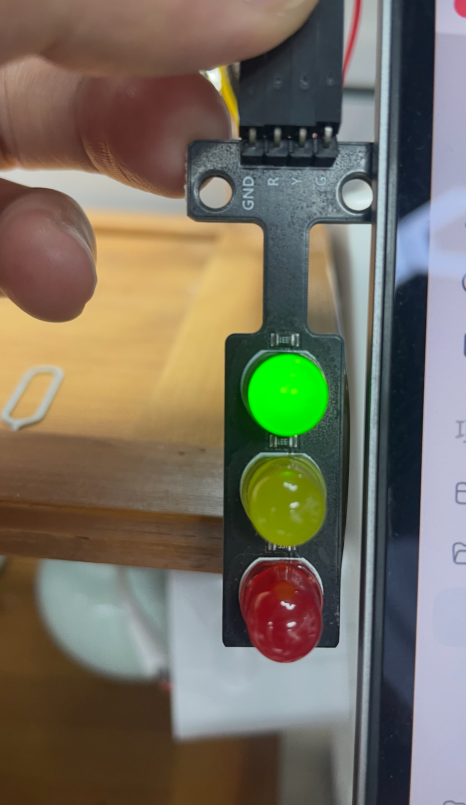

# Codex Status Light

一个给 Codex Desktop 用的 USB 外接状态灯，基于 ESP32-C3。



这个项目会把 macOS 上 Codex Desktop 的工作状态同步到一个小型三色交通灯模块：

```text
idle       绿灯常亮
busy       黄灯慢闪
attention  红灯慢闪
```

其中 `attention` 的含义是“需要你处理”，不只代表报错。它包括等待确认、等待授权/输入/登录、任务失败，以及其他需要你回来看一眼的阻塞状态。

首版刻意保持简单：

- 只支持 macOS
- 只支持 Codex Desktop
- 只走 USB 串口
- 硬件使用 ESP32-C3 + 红/黄/绿三色交通灯模块

Wi-Fi 和 WS2812B 灯条效果会放到后续版本。当前推荐先用 USB，因为它最稳定。

## 硬件

必需：

- ESP32-C3 开发板
- 红/黄/绿交通灯 LED 模块，常见引脚为 `GND`、`R`、`Y`、`G`
- 支持数据传输的 USB-C 数据线
- 2.54mm 母对母杜邦线

推荐：

- 万用表，用来检查通断和极性
- 热缩管或端子外壳，用来加固连接

## 接线

```text
交通灯 GND -> ESP32-C3 GND
交通灯 R   -> ESP32-C3 GPIO3
交通灯 Y   -> ESP32-C3 GPIO4
交通灯 G   -> ESP32-C3 GPIO5
```

如果你的交通灯模块只有 `GND`、`R`、`Y`、`G`，不要额外连接 ESP32 的 `5V` 或 `3.3V`。只有模块明确带 `VCC` 并且说明书要求供电时，才需要接电源脚。

更完整的接线说明见 [docs/hardware.md](docs/hardware.md)。

## 上传固件

先安装 Arduino CLI 和 ESP32 开发板包，然后编译并上传：

```bash
arduino-cli compile --fqbn esp32:esp32:esp32c3 firmware/TrafficLightStatus
arduino-cli upload -p /dev/cu.usbmodem11201 --fqbn esp32:esp32:esp32c3 firmware/TrafficLightStatus
```

把 `/dev/cu.usbmodem11201` 替换成你自己的串口。

查找串口：

```bash
python3 - <<'PY'
import glob
ports = []
for pattern in [
    "/dev/cu.usbmodem*",
    "/dev/cu.SLAB_USBtoUART*",
    "/dev/cu.wchusbserial*",
    "/dev/cu.usbserial*",
]:
    ports.extend(sorted(glob.glob(pattern)))
print("\n".join(ports) if ports else "<no usb serial>")
PY
```

如果输出 `<no usb serial>`，优先检查 USB 线是不是只支持充电、不支持数据。

## 运行监听器

先 dry-run 看看当前推断状态：

```bash
python3 tools/codex_desktop_usb_light.py --once --dry-run
```

然后通过 USB 控制 ESP32：

```bash
python3 tools/codex_desktop_usb_light.py --port auto
```

如果要在 macOS 后台常驻运行，见 [docs/install-macos.md](docs/install-macos.md)。

如果只想手动测试灯是否能切换状态，见 [docs/manual-test.md](docs/manual-test.md)。

## 工作原理

监听器读取 Codex Desktop 的 rollout 日志：

```text
~/.codex/sessions/**/rollout-*.jsonl
```

然后根据任务生命周期事件推断状态：

```text
task_started                  -> busy
task_complete / turn_aborted  -> idle
confirmation / permission     -> attention
task_failed                   -> attention
```

监听器运行时会保持 USB 串口打开，避免 ESP32-C3 因为反复打开串口而重启。这也是之前测试中黄灯延迟的主要原因。

## 排障

最常见的问题是 USB 线只有充电功能。Mac 必须能看到类似下面这样的串口：

```text
/dev/cu.usbmodem11201
```

更多排障步骤见 [docs/troubleshooting.md](docs/troubleshooting.md)。

## 路线图

- V1：ESP32-C3 + 三色交通灯，通过 USB 串口控制
- V2：WS2812B 灯条或灯环，做跑马灯/拾音灯风格效果
- 后续：可选 Wi-Fi 通信，适合普通家庭网络

见 [docs/roadmap.md](docs/roadmap.md)。

## 许可证

MIT
